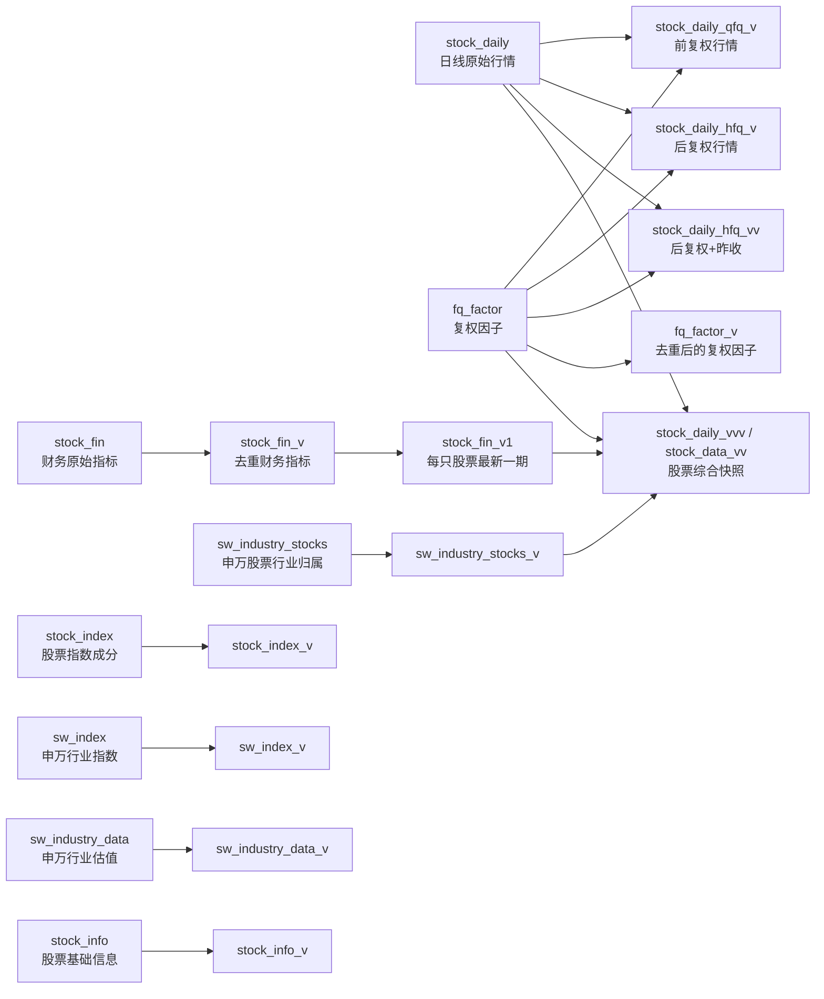

# ClickHouse 数据库表与视图说明

## 1. 文档范围

本文档描述当前 ClickHouse 实例中 `default` 数据库的物理表和视图（项目中通常称为“虚表”）。

- **实例版本**：ClickHouse `26.3.9.8`
- **数据库**：`default`
- **核对方式**：查询 `system.tables`、`system.columns`、`system.parts`，并对照 `backend/db_script/*.sql`
- **核对时间**：2026-08-02
- **对象数量**：8 张物理表、14 个普通 `View`（无 `MaterializedView`）

本文档记录的是实际实例状态；SQL 文件中存在但当前实例没有的对象不计入本清单。

## 2. 总体结构



## 3. 物理表清单

| 表 | 引擎 | 当前行数 | 磁盘占用 | 分区/排序键 | 保留策略 | 用途 |
|---|---|---:|---:|---|---|---|
| `stock_daily` | ReplacingMergeTree | 18,413,186 | 536.60 MiB | `toYYYYMM(date)` / `(code,date)` | `date + 40 年` | 股票日线原始行情 |
| `stock_fin` | ReplacingMergeTree | 498,326 | 266.99 MiB | `toYYYYMM(date)` / `(code,date)` | `date + 40 年` | 股票财务指标原始快照 |
| `sw_index` | ReplacingMergeTree | 373,854 | 56.29 MiB | `toYYYYMM(date)` / `(IndustryCode,date)` | `date + 40 年` | 申万行业指数及估值指标 |
| `stock_index` | ReplacingMergeTree | 251,772 | 5.28 MiB | `index_name` / `(code,index_code)` | 无 TTL | 股票与指数成分关系 |
| `fq_factor` | ReplacingMergeTree | 58,908 | 5.29 MiB | `code` / `(code,date)` | `date + 50 年` | 前复权、后复权因子 |
| `sw_industry_data` | MergeTree | 9,960 | 149.09 KiB | `toYYYYMM(timestamp)` / `(industry_code,timestamp)` | `timestamp + 10 年` | 申万行业汇总估值数据 |
| `sw_industry_stocks` | ReplacingMergeTree | 5,186 | 116.83 KiB | 无分区 / `code` | 无 TTL | 股票的申万行业归属 |
| `stock_info` | ReplacingMergeTree | 0 | 0 | `substring(market,1,2)` / `(code,market)` | `_updated + 36 个月` | 股票名称、公司和市场基础信息 |

行数和磁盘占用来自 `system.parts` 的 active parts 汇总，视图不占用独立数据存储；合并、TTL 执行后数值可能变化。

## 4. 通用存储约定

### 4.1 版本去重

`stock_daily`、`stock_fin`、`fq_factor`、`stock_index`、`stock_info`、`sw_index`、`sw_industry_stocks` 使用 `ReplacingMergeTree(_version)`。写入时允许同一业务键出现多版本记录，视图通过 `argMax(字段, _version)` 选择最新值。

因此：

1. 直接查询物理表时，不应假设同一业务键只有一行。
2. 需要业务最新值时，优先查询对应的 `_v` 视图，或在 SQL 中使用与视图一致的 `argMax` 逻辑。
3. `_version` 是内部版本列，不是业务日期；行情/财务日期仍由 `date` 表示。

### 4.2 类型约定

- `code`：股票代码，`String`。
- `date`：行情或财务数据日期；日线为 `DateTime`，财务表为 `Date`。
- 金额、价格、比例和财务指标通常为 `Float64`，数量类字段使用 `Int32`/`Int64`。
- `LowCardinality(String)` 用于重复度高的市场或行业分类字段。
- 综合视图使用 `LEFT JOIN`，行情、复权因子或财务数据缺失时会返回 `Nullable(Float64)` / `NULL`。

## 5. 物理表说明

### 5.1 `stock_daily`：股票日线原始行情

以 `(code,date)` 为业务键保存开、高、低、收、成交量、成交额、换手率和流通股本。价格列使用 Delta + ZSTD 压缩，按月份分区，适合按股票和时间范围查询。

| 字段 | 类型 | 说明 |
|---|---|---|
| `code` | String | 股票代码 |
| `date` | DateTime | 交易日期/时间 |
| `open`, `close`, `high`, `low` | Float64 | 未复权开盘、收盘、最高、最低价 |
| `volume` | Int64 | 成交量 |
| `amount` | Float64 | 成交额 |
| `turnover` | Float64 | 换手率 |
| `outstanding_share` | Float64 | 流通股本 |
| `_version` | UInt64 | ReplacingMergeTree 版本号 |

### 5.2 `fq_factor`：复权因子

以 `(code,date)` 保存复权因子。`qfq` 用于前复权，`hfq` 用于后复权。视图先按因子日期去重，再将交易日匹配到不晚于该交易日的最新因子。

| 字段 | 类型 | 说明 |
|---|---|---|
| `code` | String | 股票代码 |
| `date` | DateTime | 因子生效日期 |
| `qfq` | Float64 | 前复权因子；前复权价格通常为原价除以该因子 |
| `hfq` | Float64 | 后复权因子；后复权价格通常为原价乘以该因子 |
| `_version` | UInt64 | 版本号 |

### 5.3 `stock_fin`：财务指标原始表

按 `(code,date)` 保存财报指标，字段均为 `Float64`，并按月份分区。指标前缀表示指标族：

| 指标族 | 字段 |
|---|---|
| `CM` 常用指标 | `CM_NPAS`, `CM_TOR`, `CM_OC`, `CM_NP`, `CM_NRNP`, `CM_TSE_NA`, `CM_GW`, `CM_NOCF`, `CM_BEPS`, `CM_NAPS`, `CM_CFPS`, `CM_ROE`, `CM_ROA`, `CM_GM`, `CM_NPM`, `CM_PER`, `CM_ALR` |
| `PSI` 每股指标 | `PSI_BEPS`, `PSI_DEPS`, `PSI_DEPS_LSC`, `PSI_DNAPS_PSC`, `PSI_ANAPS_PSC`, `PSI_NAPS_LSC`, `PSI_OCFPS`, `PSI_NCFPS`, `PSI_FCFFPS`, `PSI_FCFEPS`, `PSI_UPPS`, `PSI_CRPS`, `PSI_SRPS`, `PSI_REPS`, `PSI_ORPS`, `PSI_TORPS`, `PSI_EBITPS` |
| `PCP` 盈利能力 | `PCP_ROE`, `PCP_DROE`, `PCP_AROE`, `PCP_AROE_ENR`, `PCP_DROE_ENR`, `PCP_EBITM`, `PCP_ROA`, `PCP_ROTC`, `PCP_ROIC`, `PCP_AROAAt_EI`, `PCP_GM`, `PCP_NPM`, `PCP_CEPR`, `PCP_OPM`, `PCP_ANPMTA`, `PCP_ANPMTA_IMI` |
| `GCP` 成长能力 | `GCP_NPAS`, `GCP_TOR`, `GCP_NP`, `GCP_NRNP`, `GCP_TORGR`, `GCP_GRNPAPC` |
| `EQL` 收益质量 | `EQL_NOCF_SR`, `EQL_NOCF_TOR`, `EQL_CER`, `EQL_PER`, `EQL_CSR`, `EQL_NOCF_NPAPC`, `EQL_IT_TP` |
| `FR` 财务风险 | `FR_CR`, `FR_QR`, `FR_CQR`, `FR_ALR`, `FR_EM`, `FR_EM_IMINA`, `FR_DER`, `FR_CashR` |
| `OCP` 营运能力 | `OCP_ART`, `OCP_ARTD`, `OCP_IT`, `OCP_ITD`, `OCP_TAT`, `OCP_TATD`, `OCP_CAT`, `OCP_CATD`, `OCP_APT` |

`code` 和 `date` 是维度列，`_version` 是版本列。各指标的中文释义和使用建议见 [财务指标说明.md](财务指标说明.md)。

### 5.4 `stock_index`：股票指数成分关系

保存股票与指数的多对多关系。一个股票可属于多个指数，一个指数包含多只股票；`(code,index_code)` 是去重键。

| 字段 | 类型 | 说明 |
|---|---|---|
| `code` | String | 股票代码 |
| `name` | String | 股票名称 |
| `index_code` | String | 指数代码 |
| `index_name` | String | 指数名称 |
| `_version` | UInt64 | 版本号 |

### 5.5 `stock_info`：股票基础信息

保存股票静态/低频基础资料，按市场前缀分区。当前实例行数为 0，应用使用前应先完成基础信息同步。

| 字段 | 类型 | 说明 |
|---|---|---|
| `code` | String | 股票代码 |
| `name` | String | 股票简称 |
| `company_name` | String | 公司全称 |
| `market` | String | 市场标识 |
| `listing_date` | Date | 上市日期 |
| `_version` | UInt64 | 版本号 |
| `_updated` | DateTime | 写入/更新时间 |

### 5.6 `sw_index`：申万行业指数数据

按 `(IndustryCode,date)` 保存行业指数行情、估值、分位数、成交和拥挤度指标。`lyrPe`/`ttmPe` 是静态/滚动市盈率，`pb` 是市净率，`dvRatio`/`dvTtm` 是股息相关指标，`add*` 表示全收益/调整口径字段，`middle*` 表示中位数统计。

除维度列外的字段如下：

`lyrPe`, `lyrPeQuantile`, `ttmPe`, `ttmPeQuantile`, `pb`, `pbQuantile`, `dvRatio`, `dvRatioQuantile`, `dvTtm`, `dvTtmQuantile`, `addLyrPe`, `addLyrPeQuantile`, `addTtmPe`, `addTtmPeQuantile`, `addPb`, `addPbQuantile`, `addDvRatio`, `addDvTtm`, `turnoverRate`, `turnoverRateF`, `addTurnoverRate`, `addTurnoverRateF`, `turnoverRateFQuantile`, `totalMv`, `close`, `addClose`, `middleLyrPe`, `middleLyrPeQuantile`, `middleTtmPe`, `middleTtmPeQuantile`, `middlePb`, `middlePbQuantile`, `belowNetAssetPercent`, `belowNetAssetCount`, `total`, `value5`, `value10`, `value20`, `value60`, `indexClose`, `amount`, `amountCongestion`, `amountCongestionQuantile`。

其中 `IndustryCode` 为行业代码，`date` 为数据日期，`belowNetAsset*` 表示破净统计，`value5/10/20/60` 为原始字符串形式的区间/周期值，`amount` 和 `amountCongestion` 在当前表中也是 `String`，使用时不要按数值列假设。

### 5.7 `sw_industry_data`：申万行业汇总估值

使用普通 `MergeTree` 保存行业历史快照，不做版本替换；同一行业可保留多个时间点。

| 字段 | 类型 | 说明 |
|---|---|---|
| `industry_code` | String | 行业代码 |
| `industry_name` | String | 行业名称 |
| `parent_industry` | String | 上级行业 |
| `component_count` | Int32 | 成分股数量 |
| `static_pe` | Float64 | 静态市盈率 |
| `ttm_pe` | Float64 | TTM 市盈率 |
| `pb_ratio` | Float64 | 市净率 |
| `static_dividend_yield` | Float64 | 静态股息率 |
| `timestamp` | DateTime | 快照时间 |
| `_version` | UInt64 | 写入版本（本表不作为 MergeTree 去重版本） |

### 5.8 `sw_industry_stocks`：股票申万行业归属

以股票代码为排序键保存当前行业归属，使用 `LowCardinality` 压缩重复分类值。

| 字段 | 类型 | 说明 |
|---|---|---|
| `code` | String | 股票代码，业务去重键 |
| `market` | LowCardinality(String) | 市场标识 |
| `stock_name` | String | 股票名称 |
| `sw_first_level` | LowCardinality(String) | 申万一级行业 |
| `sw_second_level` | LowCardinality(String) | 申万二级行业 |
| `sw_third_level` | LowCardinality(String) | 申万三级行业 |
| `update_time` | DateTime | 行业归属更新时间 |
| `_version` | UInt64 | 版本号 |

## 6. 视图（虚表）说明

### 6.1 复权行情视图

| 视图 | 输出列 | 逻辑和适用场景 |
|---|---:|---|
| `fq_factor_v` | 4 | 对 `fq_factor` 按 `(code,date)` 使用 `argMax(...,_version)` 去重，输出最新 `qfq`/`hfq`。 |
| `stock_daily_qfq_v` | 10 | 原始日线匹配交易日前最近复权因子，开高低收除以 `qfq`；保留成交量、成交额、换手率和流通股本。 |
| `stock_daily_qfq_vv` | 10 | 与 `stock_daily_qfq_v` 当前定义相同，属于同口径的兼容命名视图。 |
| `stock_daily_hfq_v` | 10 | 原始日线匹配交易日前最近复权因子，开高低收乘以 `hfq`，额外输出 `hfq`。 |
| `stock_daily_hfq_vv` | 11 | 后复权行情，额外用窗口函数按股票和日期计算上一交易日收盘价 `close_lag1`。 |

复权视图通过 `INNER JOIN` 匹配复权因子；没有可用因子的股票/日期不会出现在结果中。复权因子变更后视图会随查询实时反映物理表中的最新版本。

### 6.2 财务指标视图

| 视图 | 输出列 | 逻辑和适用场景 |
|---|---:|---|
| `stock_fin_v` | 82 | 对 `stock_fin` 按 `(code,date)` 聚合，所有指标使用 `argMax(指标,_version)`，保留每个财报日期一行。适合财务历史趋势。 |
| `stock_fin_v1` | 82 | 基于 `stock_fin_v`，每只股票只保留 `max(date)`，适合股票列表/详情页的最新财务指标。 |

两个视图的公共字段是 `code`、`date` 和上文列出的 80 个财务指标；指标值类型均为 `Float64`。

### 6.3 股票基础和行业视图

| 视图 | 输出列 | 逻辑和适用场景 |
|---|---:|---|
| `stock_index_v` | 4 | 按 `(code,index_code)` 去重，输出最新股票名称和指数名称。 |
| `stock_info_v` | 5 | 按 `(code,market)` 聚合基础信息，输出最新名称、公司名和上市日期。 |
| `sw_industry_stocks_v` | 7 | 按 `code` 聚合行业归属，分类字段取最新版本，`update_time` 取最大值；适合作为股票行业维度表。 |
| `sw_industry_data_v` | 9 | 按 `industry_code` 聚合，返回每个行业最新的一组名称、层级、成分数和估值数据。 |
| `sw_index_v` | 45 | 按 `(IndustryCode,date)` 对申万行业指数的全部数值/字符串指标做版本去重。 |

### 6.4 综合股票快照视图

`stock_daily_vvv` 与 `stock_data_vv` 当前实例中的定义和输出列完全相同，都是 93 列，可视为同一综合查询的两个兼容名称。

处理流程：

1. 从 `stock_daily` 按股票取最新 `close`。
2. 从 `fq_factor` 按股票取最新 `hfq`。
3. 从 `sw_industry_stocks_v` 取得市场、名称和申万三级行业。
4. 从 `stock_fin_v1` 取得每只股票最新财务指标。
5. 用 `LEFT JOIN` 汇总为一行股票快照。

输出字段分为：

| 字段组 | 字段 |
|---|---|
| 股票和行业维度 | `code`, `market`, `name`, `sw_first_level`, `sw_second_level`, `sw_third_level` |
| 行情/复权 | `close`, `hfq` |
| 预留估值字段 | `pe`, `pe_ttm`, `pb`, `dividend_yield`, `market_cap`（当前定义显式返回 `NULL`） |
| 财务指标 | `stock_fin_v1` 中的 80 个指标，名称与第 5.3 节一致 |

由于是左连接，股票缺行情、因子或财务数据时对应字段为 `NULL`。当前实现将估值五字段固定为 `Nullable(Float64)` 空值，不能把它们解释为已计算的估值指标。

## 7. 查询和维护建议

### 7.1 推荐入口

| 需求 | 推荐对象 |
|---|---|
| 原始日线回溯 | `stock_daily` |
| 前复权/后复权行情 | `stock_daily_qfq_v` / `stock_daily_hfq_v` |
| 后复权并需要昨收 | `stock_daily_hfq_vv` |
| 财务历史序列 | `stock_fin_v` |
| 最新财务指标 | `stock_fin_v1` |
| 股票行业归属 | `sw_industry_stocks_v` |
| 股票综合列表 | `stock_daily_vvv` 或 `stock_data_vv` |

### 7.2 风险提示

1. 视图并不缓存结果，复杂综合视图会在查询时重新扫描和连接多个物理表；批量查询应限制日期/股票范围。
2. ReplacingMergeTree 的物理合并是异步的。不要用物理表的 `count()` 直接当作业务去重后的记录数。
3. `stock_info_v` 的视图声明列顺序为 `code,name,company_name,market,listing_date`，其 SQL 文本的 `SELECT` 子句第二到第四列顺序与声明存在差异；使用前应通过 `SELECT * FROM default.stock_info_v LIMIT ...` 校验实际返回值，必要时修正视图定义。
4. `stock_daily_vvv` 和 `stock_data_vv` 是重复定义，后续应统一一个名称，避免应用层出现口径分叉。
5. `sw_industry_data` 使用普通 `MergeTree`，不会按 `_version` 自动替换；如需“最新一条”，应使用 `sw_industry_data_v` 或显式按业务时间筛选。
6. SQL 文件中的 `inst_trading_tracker`、`inst_trading_tracker_local`、`stock_daily_all` 是 `ATTACH`/分布式表脚本，当前 `default.system.tables` 未发现对应对象，不应视为当前库已存在的表。

## 8. 常用核对 SQL

```sql
-- 当前库对象清单
SELECT name, engine, create_table_query
FROM system.tables
WHERE database = 'default'
ORDER BY engine, name;

-- 字段清单
SELECT table, position, name, type, default_kind, default_expression
FROM system.columns
WHERE database = 'default'
ORDER BY table, position;

-- ReplacingMergeTree 业务去重示例
SELECT code, date, argMax(close, _version) AS close
FROM default.stock_daily
GROUP BY code, date;
```
